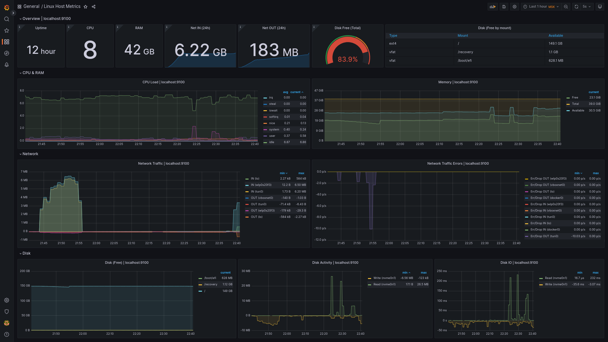
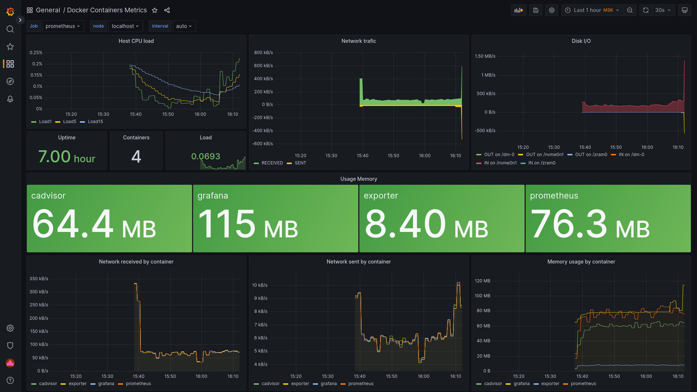
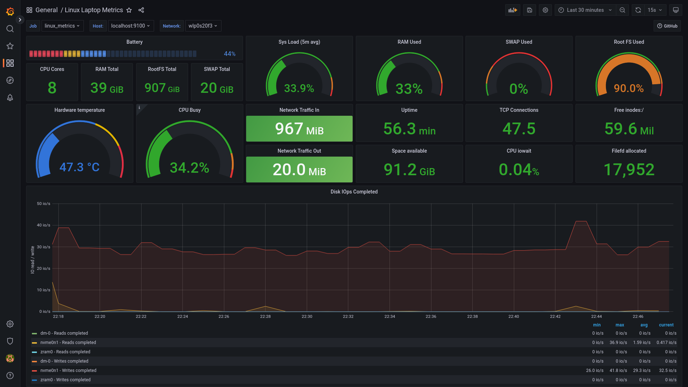
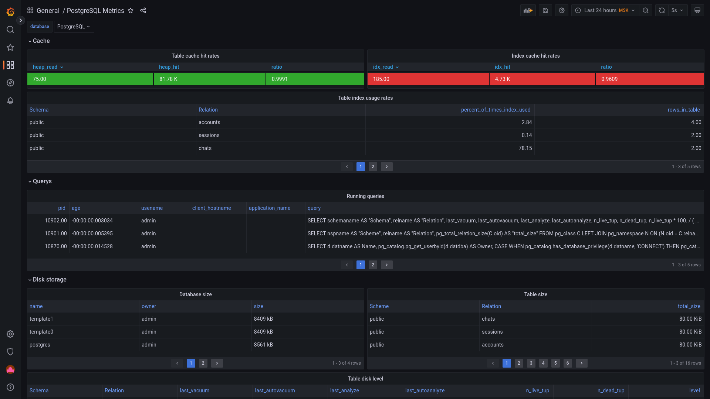
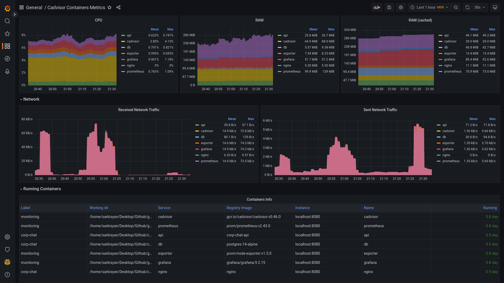
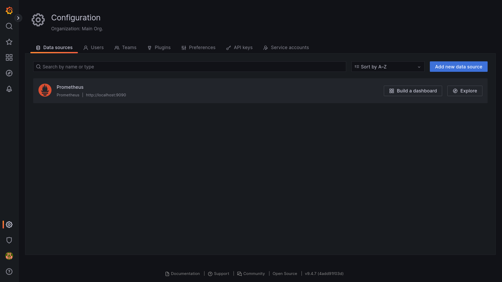

# how to

* Add `.env` file (in `./` folder)
* Execute command`docker compose -p monitoring up -d --wait grafana` (in `./` folder)

If you want to use Postgres performance metrics add postgress eporter manualy (more information in video)

https://youtu.be/HLkBQC4mcp4

# .env params

*Grafana creds*
* `GF_SECURITY_ADMIN_USER=admin`
* `GF_SECURITY_ADMIN_PASSWORD=qwerty12`

# http page

*Grafana web UI*
`http://localhost:3000`

# screenshots

